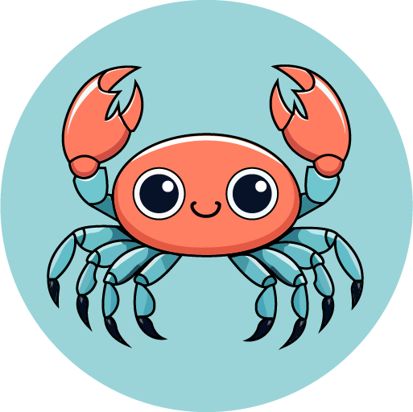

# [`ClawVault`](https://claw-vault.up.railway.app)

A platform to share sensitive information with desired recipients.

Meet our mascot, Claw ! 

Claw is a crab who loves to keep things safe and secure with it's strong claws.
He is a symbol of commitment to privacy and security.

## About
Meet [Claw Vault](https://claw-vault.up.railway.app), a platform to share sensitive information with desired recipients. Claw Vault encrypts your data, providing a unique ID and key for secure transmission. Your recipient can easily access the encrypted content using the ID and key, ensuring confidentiality. Data is automatically deleted upon access or expiration, prioritizing your privacy.

## Flow

Here is a flow diagram of how the API works.

## Privacy Policy

If you are interested in privacy policy, you can find it [here](https://claw-vault.up.railway.app/privacy).

Rest assured that the data is not accessible to anyone (including me) except the recipient and the sender with the presense of unique ID and key.
