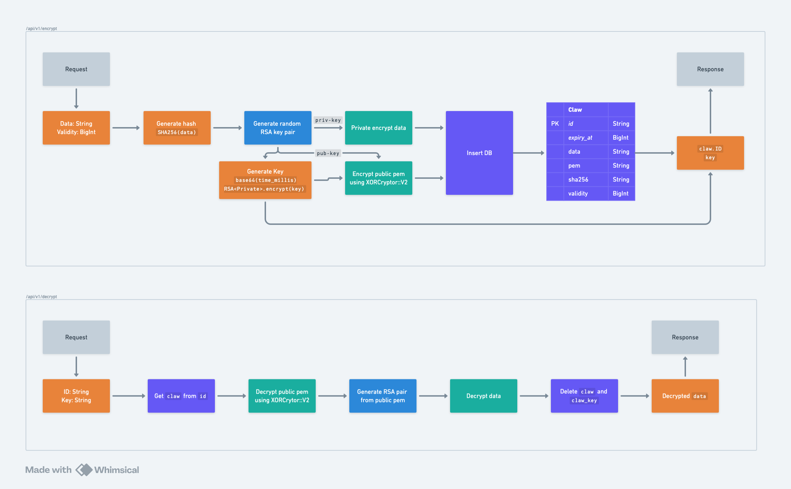

# [`ClawVault-Backend`](https://claw-vault-api.up.railway.app)

A platform to share sensitive information with desired recipients.

## Cryptographic Libraries

Here are the cryptographic libraries used in the project:
- [`OpenSSL`](https://crates.io/crates/openssl) - For RSA and SHA256
- [`XORCryptor (XRC)`](https://crates.io/crates/xor_cryptor) - For strong randomized chained cipher XOR encryption
- [`Base64`](https://crates.io/crates/base64) - For Base64 encoding and decoding

## Flow

Here is a flow diagram of how the API works.

## Privacy Policy

If you are interested in privacy policy, you can find it [here](https://claw-vault.up.railway.app/privacy).

Rest assured that the data is not accessible to anyone (including me) except the recipient and the sender with the presense of unique ID and key.
